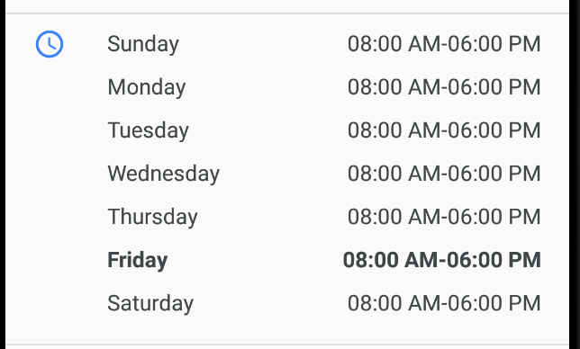
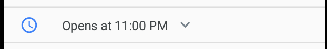
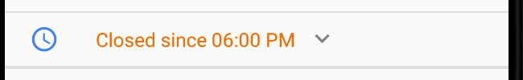
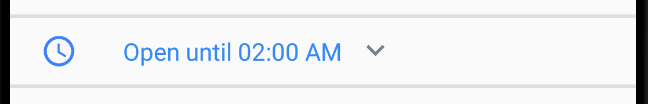

<br><br/>

# Open hours for Android
[](https://bintray.com/andreperegrina/android/open-hours/_latestVersion)

## About

Android library for the business hours like google maps component.

## Requirements

- Android 4.4 KitKat (API lvl 19) or greater

## Installation

Just use the maven repo

Gradle:

```
dependencies {
    implementation 'com.andreperegrina.openhours:openhours:0.1'
}
```

Maven:

```
<dependency>
  <groupId>com.andreperegrina.openhours</groupId>
  <artifactId>openhours</artifactId>
  <version>0.1</version>
  <type>pom</type>
</dependency>
```

## Basic usage

`OpenHours` is a custom `LinearLayout` with a business hours attached.

Here are the attributes you can specify in the XML layout:

- `openHoursSundayLabel` - Default value is Sunday

- `openHoursMondayLabel` - Default value is Monday
- `openHoursTuesdayLabel` - Default value is Tuesday
- `openHoursWednesdayLabel` - Default value is Wednesday
- `openHoursThursdayLabel` - Default value is Thursday
- `openHoursFridayLabel` - Default value is Friday
- `openHoursSaturdayLabel` - Default value is Saturday

To inizialice the component you need to send an array of `BussinessHour` like in this example:

Java:

```java
OpenHours openHours = findViewById<OpenHours>(R.id.open_hours_component);
ArrayList<BusinessHour> arrayList = new ArrayList<BusinessHour>();
for (int i = 0; i < 8; i++)
    arrayList.add(new BusinessHour(BusinessDay.valueOf(i), 8, 0, 18, 0));
openHours.initBusinessHour(arrayList);
```

Kotlin:

```kotlin
val openHours = findViewById<OpenHours>(R.id.open_hours_component)
val arrayList = ArrayList<BusinessHour>()
for (i in 1..8) 
	arrayList.add(BusinessHour(BusinessDay.valueOf(i), 8, 0, 18, 0))
openHours.initBusinessHour(arrayList)
```

This example will init from **sunday** to **saturday** the business hours to **8:00 AM** to **6:00 PM**. Like the example below:



Now, if you want to make the table open, you need to call the `toggleOpenHours()` method:

Java:

```java
openHours.setOnClickListener(new View.OnClickListener() {
    @Override
    public void onClick(View view) {
        openHours.toggleOpenHours();
    }
});
```

Kotlin:

```kotlin
openHours.setOnClickListener {
    openHours.toggleOpenHours()
}
```

## Other functionality

The library also detect from the current time if the place is **Open until, Closed, or Opens at** like in the images below:

**Opens At:**



**Closed:**



**Open until:**



## License

 OpenHours for Android is released under the Apache License 2.0. See [LICENSE](https://github.com/andreperegrina/open-hours/blob/master/LICENSE.md) for details.

